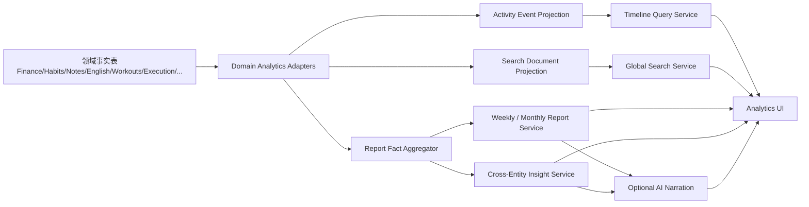

# LifeTrace EPIC-14 分析与洞察执行报告

> 状态：待实施 / 可直接交给 Agent 执行  
> 日期：2026-08-09  
> Roadmap：EPIC-14 · 分析与洞察（统一时间线 + 全局搜索 + 周/月报告 + 跨实体洞察）  
> 适用仓库：`zhouxingxing1279/LifeTrace`

---

## 1. 执行结论

EPIC-14 不应被实现成一个单独的“AI 分析页面”，而应建设为 LifeTrace 的**跨领域分析基础层**。

当前 LifeTrace 的财务、习惯、笔记、英语、训练、执行系统等数据分别由独立领域表和 Repository 管理。EPIC-14 的职责不是替代这些领域模型，而是在它们之上建立一套**可重建、可追溯、可查询的派生数据层**，再向统一时间线、全局搜索、周/月报告和跨实体洞察提供稳定数据。

推荐执行顺序：

1. 建立统一分析事件模型与领域 Adapter；
2. 完成统一时间线及全量重建能力；
3. 建立全局搜索索引；
4. 建立确定性统计与周/月报告；
5. 在确定性事实之上增加 AI 总结；
6. 最后实现跨实体关联洞察；
7. 补齐增量更新、删除同步、回填、性能、可观测性与回滚机制。

核心原则：

- **领域数据是事实源（Source of Truth），分析表只是派生数据。**
- **任何分析索引必须可以从事实源完整重建。**
- **AI 不能生成或修改核心统计数字，只能解释已经计算出的事实。**
- **跨实体分析默认表达相关性，不表达未经验证的因果关系。**
- **本地优先：时间线、搜索和基础报告必须在离线状态下可用。**

---

## 2. 当前仓库基线

根据当前主分支代码，EPIC-14 应沿用现有 Tauri + Rust + SQLite 的桌面端架构，而不是另建一套前端数据库聚合逻辑。

已确认的现有结构包括：

```text
apps/desktop/
├─ src/                          # TypeScript 客户端代码
│  ├─ db/sqliteClient.ts
│  ├─ services/
│  ├─ stores/
│  ├─ types/
│  └─ ui/
├─ app/                          # 当前桌面界面样式与页面相关资源
└─ src-tauri/src/
   ├─ database/
   │  ├─ migration_runner.rs
   │  ├─ migrations/
   │  │  ├─ m0001_framework.rs
   │  │  ├─ ...
   │  │  └─ m0011_execution_completion_backfill.rs
   │  └─ repositories/
   │     ├─ finance.rs
   │     ├─ habits.rs
   │     ├─ notes.rs
   │     ├─ english.rs
   │     ├─ workouts.rs
   │     └─ execution*.rs
   ├─ execution*.rs
   └─ lib.rs
```

因此建议 EPIC-14 新增 `m0012_analytics_insights.rs`，并新增独立 `analytics` Repository/Command/Frontend Service。不要让前端分别调用 finance、habits、notes、english、workouts 等接口后再临时拼接时间线或统计数据，否则会带来重复逻辑、分页错误、时区不一致和后续同步困难。

---

## 3. Roadmap 需求拆解

### 3.1 R1：统一时间线

统一时间线需要按真实发生时间，将 LifeTrace 中不同领域的用户事件汇总成一个连续的个人活动流。

首批应覆盖已具备稳定数据结构的领域：

- 日历 / 执行事件；
- 习惯打卡与完成记录；
- 健身训练记录；
- 英语阅读、学习、单词/复习等学习事件；
- 笔记及重要记录；
- 财务交易；
- 后续已落地的跑步、饮食、体重、睡眠、步数、照片等事件。

时间线必须支持：

- 开始时间、结束时间筛选；
- 按领域筛选；
- 按事件类型筛选；
- 关键字搜索；
- 分页 / 游标加载；
- 按时间倒序展示；
- 点击事件跳回原始实体详情；
- 同一实体修改后时间线同步更新；
- 原始实体删除后时间线不残留脏数据。

### 3.2 R2：全局搜索

全局搜索不是“只搜标题”，而是跨实体统一搜索入口。

建议纳入搜索的内容包括：

- 笔记标题、正文、标签；
- 英语文章标题、正文、学习笔记、单词；
- 训练名称、动作、训练备注；
- 习惯项目与记录；
- 财务交易商户、备注、分类；
- 日历 / 执行系统标题、描述；
- 后续饮食、照片、健康记录等可文本化字段。

搜索结果至少返回：

- `entityType`；
- `entityId`；
- 领域；
- 标题；
- 命中摘要；
- 发生/更新时间；
- 可跳转的详情目标；
- 排序得分。

支持：

- 关键字搜索；
- 领域过滤；
- 类型过滤；
- 时间范围过滤；
- 相关性排序；
- 时间排序；
- 命中片段高亮。

### 3.3 R3：周报与月报

周报/月报必须先完成**确定性事实计算**，再决定是否调用大语言模型生成自然语言总结。

报告内容按当前已存在领域逐步接入，目标覆盖：

- 习惯完成率、连续完成情况；
- 训练次数、训练量和主要动作；
- 跑步里程、配速等运动指标；
- 英语学习天数、阅读进度、单词/错词等；
- 阅读与笔记进度；
- 睡眠、步数、体重趋势；
- 饮食热量与宏量营养；
- 收支、消费结构、资产变化；
- 照片/生活事件摘要；
- 情绪、精力等趋势；
- 重要日历与执行结果。

没有数据的领域不得填充伪数据，应明确显示“本周期无数据”或不展示该模块。

### 3.4 R4：跨实体关联洞察

EPIC-14 最终需要从“统计各模块”升级到“理解各模块之间的关系”。

第一阶段只做**可解释的规则型/统计型洞察**，例如：

- 睡眠时长与第二天训练完成度的共同变化；
- 英语阅读文章与对应学习笔记的关联；
- 习惯完成率与执行系统任务完成情况的周期变化；
- 特定旅行/日历时段与支出变化；
- 训练频率与体重趋势的同期变化。

所有关联类洞察必须携带样本范围，样本不足时不得给出强结论。界面与 AI 文案必须使用“相关”“同期变化”“观察到”之类措辞，禁止自动写成因果结论。

---

## 4. 目标架构



必须坚持“Adapter → Projection → Query”的结构，而不是让时间线、搜索、报告分别读取所有领域表。

这样可以保证：

- 新增领域时只增加一个 Adapter；
- 时间线、搜索、报告可以复用统一字段；
- 分析数据可增量更新，也可全量重建；
- 同步后可以统一触发重建/补偿；
- 分析逻辑不会侵入各业务模块。

---

## 5. 数据模型设计

### 5.1 `analytics_events`

统一时间线的派生事件表。

建议字段：

```text
id                  TEXT PRIMARY KEY
occurred_at         INTEGER NOT NULL
ended_at            INTEGER NULL
timezone             TEXT NULL
domain               TEXT NOT NULL
event_type           TEXT NOT NULL
title                TEXT NOT NULL
summary              TEXT NULL
entity_type          TEXT NOT NULL
entity_id            TEXT NOT NULL
source_updated_at    INTEGER NULL
metrics_json         TEXT NULL
tags_json            TEXT NULL
search_text          TEXT NULL
projection_version   INTEGER NOT NULL
projected_at         INTEGER NOT NULL
```

要求：

- `id` 必须稳定、确定、幂等；
- 推荐规则：`<domain>:<entity_type>:<entity_id>[:<sub_event>]`；
- 不使用随机 UUID 作为投影事件 ID；
- 同一原始记录重复投影必须执行 UPSERT，而不是插入重复事件；
- `entity_type + entity_id` 用于详情页反向跳转；
- `metrics_json` 只保存时间线/报告需要的轻量指标，不复制整个业务对象。

建议索引：

```text
(occurred_at DESC)
(domain, occurred_at DESC)
(event_type, occurred_at DESC)
(entity_type, entity_id)
```

### 5.2 `search_documents`

全局搜索的统一文档表。

```text
id
entity_type
entity_id
domain
title
body
keywords
tags
occurred_at
updated_at
projection_version
```

如果当前 SQLite 构建支持 FTS5，优先在该表之上建立 FTS5 虚拟表；如果构建环境不能稳定提供 FTS5，则先实现普通索引 + LIKE 的兼容实现，再将搜索引擎封装在 Repository 内，避免 UI 感知底层实现。

### 5.3 `analytics_reports`

保存已经生成的报告快照，避免每次打开页面都重新聚合和调用 AI。

```text
id
report_type            # weekly | monthly
period_start
period_end
timezone
facts_json
narrative_json          # 可为空
source_coverage_json
facts_version
prompt_version          # 未调用 AI 时可为空
model_info_json         # 未调用 AI 时可为空
generated_at
updated_at
```

唯一约束建议：

```text
(report_type, period_start, period_end, timezone, facts_version)
```

### 5.4 `analytics_insights`

用于持久化可重复展示的跨实体洞察快照。

```text
id
insight_type
period_start
period_end
title
summary
evidence_json
sample_size
confidence_json
algorithm_version
created_at
```

不要把 AI 生成文本当成 `evidence_json`。证据必须来自可复算的数据。

---

## 6. 投影与一致性机制

### 6.1 事实源边界

现有领域 Repository 保持不变：

```text
finance.rs
habits.rs
notes.rs
english.rs
workouts.rs
execution*.rs
```

Analytics 只读取这些领域数据，不反向修改业务数据。

### 6.2 投影方式

第一版采用“**增量刷新 + 可重建兜底**”即可，不需要为了 EPIC-14 立即引入复杂消息总线。

提供两个核心能力：

```rust
refresh_analytics_for_entity(domain, entity_type, entity_id)
rebuild_analytics_index(scope)
```

其中 `scope` 至少支持：

- 全部；
- 指定领域；
- 指定时间范围。

业务写入完成后触发轻量增量刷新；应用升级、迁移、异常修复时使用全量重建。

### 6.3 删除与修改

必须验证以下链路：

```text
Create source -> projection created
Update source -> projection replaced
Delete source -> projection removed
Rebuild       -> result identical, no duplicates
```

不能只处理新增，否则时间线和搜索会长期残留旧数据。

### 6.4 时区

所有统计必须明确区分：

- 数据库存储时间；
- 用户本地日历日期；
- 周起始日；
- 月边界。

周报/月报必须使用用户配置的本地时区计算周期边界。禁止简单用 UTC `00:00` 切日，否则跨时区后会出现事件归错天、归错周的问题。

---

## 7. 后端执行方案

### Phase A：数据库与核心类型

新增：

```text
apps/desktop/src-tauri/src/database/migrations/m0012_analytics_insights.rs
apps/desktop/src-tauri/src/database/repositories/analytics.rs
apps/desktop/src-tauri/src/analytics.rs
```

修改：

```text
apps/desktop/src-tauri/src/database/migrations/mod.rs
apps/desktop/src-tauri/src/database/repositories/mod.rs
apps/desktop/src-tauri/src/lib.rs
```

任务：

- 建立四类分析表；
- 建立必要索引；
- 建立 Rust DTO；
- 完成 migration rollback / validation；
- 接入现有 migration runner；
- Repository 不向 UI 暴露裸 SQL。

### Phase B：领域 Adapter 与时间线

在 `analytics.rs` 或拆分后的 `analytics/adapters/` 中实现各领域转换器：

```text
FinanceAnalyticsAdapter
HabitAnalyticsAdapter
NoteAnalyticsAdapter
EnglishAnalyticsAdapter
WorkoutAnalyticsAdapter
ExecutionAnalyticsAdapter
```

统一输出 `ActivityEventProjection`。

完成接口：

```text
analytics_rebuild
analytics_refresh_entity
analytics_timeline_query
analytics_projection_status
```

时间线查询参数至少包含：

```text
from
to
domains[]
eventTypes[]
keyword
cursor
limit
```

推荐游标分页，不要使用大 offset 作为长期方案。

### Phase C：全局搜索

完成：

```text
analytics_search
analytics_search_rebuild
```

每个 Adapter 同时负责将实体转换为 `SearchDocumentProjection`。

搜索排序建议：

1. 标题精确命中；
2. 标题前缀/高相关命中；
3. 标签/关键词命中；
4. 正文命中；
5. 在相同相关性下优先最近记录。

搜索结果必须提供统一 deep-link 元数据，让前端跳转到真实实体，而不是跳转到分析副本。

### Phase D：周报/月报

实现两层：

```text
ReportFactAggregator      # 纯确定性计算
ReportNarrationService    # 可选 AI
```

先输出如下结构的事实对象：

```json
{
  "period": {},
  "coverage": {},
  "habits": {},
  "workouts": {},
  "english": {},
  "finance": {},
  "notes": {},
  "execution": {}
}
```

AI 只能读取该 facts JSON 和允许的有限文本摘要，生成：

- 本周期总结；
- 变化说明；
- 值得关注的事项；
- 下一周期建议。

禁止让 AI 自己从大段原始记录中“计算”训练次数、金额、完成率、里程等数字。

AI 调用失败时，页面仍必须展示确定性统计报告。

### Phase E：跨实体洞察

第一版只实现少量高质量 Insight Provider：

```text
SleepTrainingInsightProvider        # 睡眠模块具备数据后启用
HabitExecutionInsightProvider
EnglishReadingInsightProvider
CalendarSpendingInsightProvider
WorkoutWeightInsightProvider        # 体重模块具备数据后启用
```

Provider 必须声明：

```text
required_domains
minimum_sample_size
period
algorithm_version
```

不满足数据条件时直接跳过，不生成“看起来像洞察”的空泛 AI 文案。

---

## 8. 前端执行方案

建议新增统一 Analytics 前端服务与类型：

```text
apps/desktop/src/services/analyticsApi.ts
apps/desktop/src/types/analytics.ts
```

UI 建议分为一个主入口下的四个视图，而不是四个完全独立模块：

```text
分析与洞察
├─ 时间线
├─ 搜索
├─ 报告
└─ 洞察
```

### 8.1 时间线界面

布局：

- 顶部：时间范围、领域、事件类型、搜索框；
- 主区：按日期分组的时间流；
- 每条记录：时间、领域图标、标题、关键指标、摘要；
- 点击：打开原始实体；
- 长列表：虚拟化或分批加载。

避免把每个事件展示成包含大量说明文字的小卡片。时间线核心是“快速扫视一天/一周发生了什么”。

### 8.2 全局搜索

建议支持全局快捷键唤起搜索，例如 `Ctrl/Cmd + K`，但应复用现有快捷键/命令系统，不重复实现键盘监听基础设施。

结果按统一格式显示，并允许按领域快速收窄。

### 8.3 周报/月报

页面结构建议：

```text
周期选择
关键摘要
领域指标区
趋势区
AI 总结（如启用）
关联洞察
数据覆盖情况
```

“数据覆盖情况”必须可见，避免用户在某领域缺数据时误以为报告已经完整分析。

### 8.4 跨实体洞察

洞察卡片至少展示：

- 发现；
- 时间范围；
- 依据；
- 样本量/覆盖度；
- 关联实体；
- 跳转入口。

不显示无法追溯来源的单句 AI 判断。

---

## 9. AI 使用边界

EPIC-14 可以接入大语言模型，但 AI 只处于报告流水线的最后一层。

正确链路：

```text
原始数据
  -> 本地 SQL/Rust 确定性聚合
  -> facts JSON
  -> 可选脱敏/裁剪
  -> LLM 总结
  -> 保存 narrative + prompt/model version
```

禁止链路：

```text
把一周全部原始数据直接发给 LLM
  -> 让模型自己数次数、算金额、推导趋势
```

原因：

- 数字不可复现；
- 容易出现幻觉；
- token 成本随数据量增长；
- 难做测试；
- 隐私暴露面过大；
- 相同数据重复生成可能得到不同事实结论。

如果使用云端模型，必须复用项目现有 AI Provider/配置体系，并记录 prompt 版本与模型信息。用户关闭 AI 或无网络时，统计报告功能不得失效。

---

## 10. 同步与多端一致性

EPIC-14 的四类表本质是**派生缓存**。默认不建议把完整 `analytics_events` / `search_documents` 当作需要跨端同步的事实表。

推荐策略：

1. 同步领域原始记录；
2. 本地收到增量后刷新相应 Analytics Projection；
3. 检测 projection version 变化时允许重建；
4. 报告如果包含用户确认后的人工编辑内容，再单独判断是否作为业务实体同步。

这样可以避免同一用户多设备分别生成投影后又互相同步，产生冲突和重复数据。

---

## 11. 测试计划

### 11.1 Migration 测试

- 新库从 `m0001 -> m0012` 正常迁移；
- 已有用户库从 `m0011 -> m0012` 正常迁移；
- 现有领域数据不被修改；
- 新表和索引正确创建；
- migration 重复执行安全。

### 11.2 投影单元测试

每个 Adapter 至少覆盖：

- 正常实体转换；
- 空字段；
- 特殊字符；
- 时区；
- 修改后 ID 不变；
- 子事件 ID 稳定；
- 删除；
- 重复 refresh 不产生重复记录。

### 11.3 时间线集成测试

准备跨领域测试数据，验证：

- 全局时间排序正确；
- 同一天多领域数据排序正确；
- 日期边界正确；
- 领域过滤正确；
- 类型过滤正确；
- 搜索正确；
- 分页无重复、无漏项；
- deep-link 指向真实实体。

### 11.4 搜索测试

- 标题命中优先于正文；
- 中文、英文、数字均可检索；
- 特殊字符不导致 SQL/FTS 错误；
- 删除源记录后搜索结果消失；
- 更新后旧文本不再命中；
- 大量记录下响应时间可接受。

### 11.5 报告测试

为每个指标准备固定 fixture，确保：

```text
输入数据固定 -> facts JSON 完全固定
```

重点测试：

- 周/月边界；
- 跨月周；
- 闰年；
- 时区切换；
- 空数据；
- 部分领域无数据；
- 同步后的补录数据；
- 报告重新生成。

### 11.6 AI 降级测试

- 未配置模型；
- 无网络；
- 超时；
- 模型返回非法 JSON；
- 模型返回与事实数字冲突的文本。

以上场景都不得导致基础报告无法打开。

### 11.7 重建一致性测试

这是 EPIC-14 的关键测试：

```text
增量投影结果
== 删除全部派生表后执行 rebuild 的结果
```

比较事件数量、ID、字段和搜索文档。若不一致，说明投影链路存在状态依赖或漏更新。

---

## 12. 性能目标与可观测性

不提前绑定具体硬件绝对数字，但必须设置自动化基准，至少覆盖：

- 1 万 / 10 万级时间线事件查询；
- 1 万 / 10 万级搜索文档；
- 一年数据生成周报/月报；
- 全量 rebuild；
- 单实体增量 refresh。

建议记录：

```text
analytics.projection.refresh.duration
analytics.projection.rebuild.duration
analytics.projection.error
analytics.timeline.query.duration
analytics.search.query.duration
analytics.report.generate.duration
analytics.report.ai.duration
analytics.report.ai.error
```

同时记录 projection version、失败领域和失败 entity ID，便于定位“某条业务数据导致整个分析页打不开”的问题。

---

## 13. 风险与防护

| 风险 | 后果 | 防护 |
|---|---|---|
| 直接前端聚合所有领域 | 逻辑重复、分页困难 | 使用统一投影 Repository |
| 投影只增不删 | 时间线/搜索长期脏数据 | Create/Update/Delete 全链路 |
| 随机投影 ID | rebuild 后重复 | 使用确定性 ID |
| 时区处理不统一 | 日/周/月统计错误 | 本地时区周期边界统一封装 |
| FTS 能力环境不一致 | 打包后搜索失效 | Repository 封装 + capability test/fallback |
| AI 负责算数字 | 报告幻觉、不可测试 | Rust/SQL 先生成 facts |
| AI 上送过量原始数据 | 隐私与成本问题 | 最小化 facts + 可选摘要 |
| 跨实体分析写成因果 | 误导用户 | 样本门槛 + 相关性措辞 |
| 派生表参与同步冲突 | 多端重复/冲突 | 默认只同步事实源，本地重建投影 |
| 新领域不断增加 | Analytics 代码膨胀 | Domain Adapter 注册机制 |

---

## 14. 回滚方案

EPIC-14 必须具备低风险回滚能力。

建议：

- Timeline、Search、Report、Insight 分别配置 feature flag；
- 分析表不成为其他业务表的反向依赖；
- 关闭 EPIC-14 后现有财务、习惯、英语、笔记、训练和执行系统继续正常使用；
- 派生表损坏时允许清空并 rebuild；
- migration 不删除、不重命名现有事实表字段；
- AI 服务异常可单独关闭，不影响本地确定性报告。

最重要的回滚边界：**EPIC-14 出问题时可以丢弃分析数据，但绝不能影响用户的原始业务数据。**

---

## 15. 分阶段执行清单

### P0：契约与数据库

- [ ] 定义 `ActivityEventProjection`；
- [ ] 定义 `SearchDocumentProjection`；
- [ ] 定义 Report Facts schema；
- [ ] 定义 Insight schema；
- [ ] 新建 `m0012_analytics_insights.rs`；
- [ ] 接入 migration runner；
- [ ] 完成 migration 测试。

**出口条件：** 新旧数据库均能安全升级，分析表可独立创建和清理。

### P1：统一时间线 MVP

- [ ] Finance Adapter；
- [ ] Habits Adapter；
- [ ] Notes Adapter；
- [ ] English Adapter；
- [ ] Workouts Adapter；
- [ ] Execution Adapter；
- [ ] 全量 rebuild；
- [ ] 单实体 refresh；
- [ ] Timeline query；
- [ ] 前端时间线；
- [ ] deep-link；
- [ ] 分页与筛选；
- [ ] rebuild 一致性测试。

**出口条件：** 已支持领域能够在一条时间线上无重复、无漏项地展示并回跳原实体。

### P2：全局搜索

- [ ] Search Projection；
- [ ] 搜索索引；
- [ ] 相关性排序；
- [ ] 领域/时间过滤；
- [ ] 命中摘要；
- [ ] 全局搜索 UI；
- [ ] 快捷入口；
- [ ] 更新/删除同步测试。

**出口条件：** 用户可以从一个入口搜索多领域实体并准确打开原始数据。

### P3：周报/月报

- [ ] Period/Timezone 工具；
- [ ] Report Fact Aggregator；
- [ ] 各领域 metrics provider；
- [ ] 报告快照；
- [ ] 周报 UI；
- [ ] 月报 UI；
- [ ] 数据覆盖展示；
- [ ] AI Narrative 可选接入；
- [ ] 无 AI 降级测试。

**出口条件：** 相同数据和版本重复生成得到相同事实指标，AI 不影响数字正确性。

### P4：跨实体洞察

- [ ] Insight Provider 协议；
- [ ] 最低样本量机制；
- [ ] 首批 2~3 个高价值 Provider；
- [ ] evidence/source 展示；
- [ ] 关联实体跳转；
- [ ] 相关性文案规则。

**出口条件：** 每条洞察均可解释其数据依据，样本不足时不输出强结论。

### P5：稳定性收尾

- [ ] 性能基准；
- [ ] 增量 refresh 失败补偿；
- [ ] projection status；
- [ ] 全量 rebuild 入口；
- [ ] 日志/指标；
- [ ] Feature Flags；
- [ ] 同步后自动刷新；
- [ ] 升级/降级验证；
- [ ] 文档更新。

---

## 16. Definition of Done

只有同时满足以下条件，EPIC-14 才算完成：

1. **统一时间线**
   - 已支持领域全部接入；
   - 时间排序、筛选、分页、搜索正确；
   - 可跳转原始实体；
   - 修改和删除可同步；
   - rebuild 不产生重复数据。

2. **全局搜索**
   - 多领域统一检索；
   - 结果有统一结构和命中摘要；
   - 支持过滤与排序；
   - 结果可回跳原实体；
   - 索引可全量重建。

3. **周报/月报**
   - 关键数字由本地确定性逻辑计算；
   - 报告可保存、重建、回溯；
   - 数据覆盖情况可见；
   - 无 AI/断网状态可正常查看基础报告；
   - AI 文本不篡改事实指标。

4. **跨实体洞察**
   - 有明确数据来源和样本范围；
   - 不把相关性表述成因果；
   - 样本不足时正确降级；
   - 洞察可跳回证据实体。

5. **工程质量**
   - Migration、Repository、Command、Frontend Service 分层清晰；
   - 派生数据可完全 rebuild；
   - 不破坏现有领域数据；
   - 多端同步后能恢复一致投影；
   - 有性能测试、日志、错误处理和 feature flag；
   - CI / 自动测试通过。

---

## 17. 建议 Agent 执行约束

将本报告交给开发 Agent 时，附加以下硬性约束：

1. 开始编码前先读取现有 migration、Repository、Tauri command 和前端 service 的真实实现方式；
2. 不创建第二套数据库访问框架；
3. 不在 React/TypeScript 前端直接跨多个领域表执行聚合 SQL；
4. 不改变现有领域事实表作为 EPIC-14 的捷径；
5. 每接入一个领域必须同时补齐 Create/Update/Delete/Rebuild 测试；
6. 每个统计数字必须能由代码复算，禁止依赖 LLM 算术；
7. AI 功能必须可关闭、可降级；
8. 每完成一个 Phase 后先运行测试并提交，再进入下一 Phase；
9. 若现有代码结构与本报告建议路径发生冲突，以仓库当前分层规范为准，但必须保留“事实源与派生层分离”的架构原则；
10. 不虚构尚未存在的跑步、饮食、健康、照片等领域接口；这些领域仅在对应业务模块稳定后通过 Adapter 接入。

---

## 18. 最终交付物

EPIC-14 完成后应至少包含：

```text
1. Analytics 数据迁移
2. Analytics Repository
3. Domain Adapter 注册机制
4. Projection rebuild / refresh
5. Timeline Tauri commands + frontend API + UI
6. Search Tauri commands + frontend API + UI
7. Report Facts Aggregator + snapshot storage + UI
8. Optional AI Narrative
9. Insight Provider + UI
10. Projection consistency tests
11. Search/report integration tests
12. Performance benchmark
13. Observability / diagnostics
14. Feature flag / rollback path
15. EPIC-14 实现与维护文档
```

完成以上内容后，LifeTrace 才真正具备一个可持续扩展的“个人数据分析层”：后续任何新模块只需要提供领域 Adapter，就能自动进入时间线、搜索、报告和洞察体系，而不需要在四套功能中重复开发跨领域逻辑。
